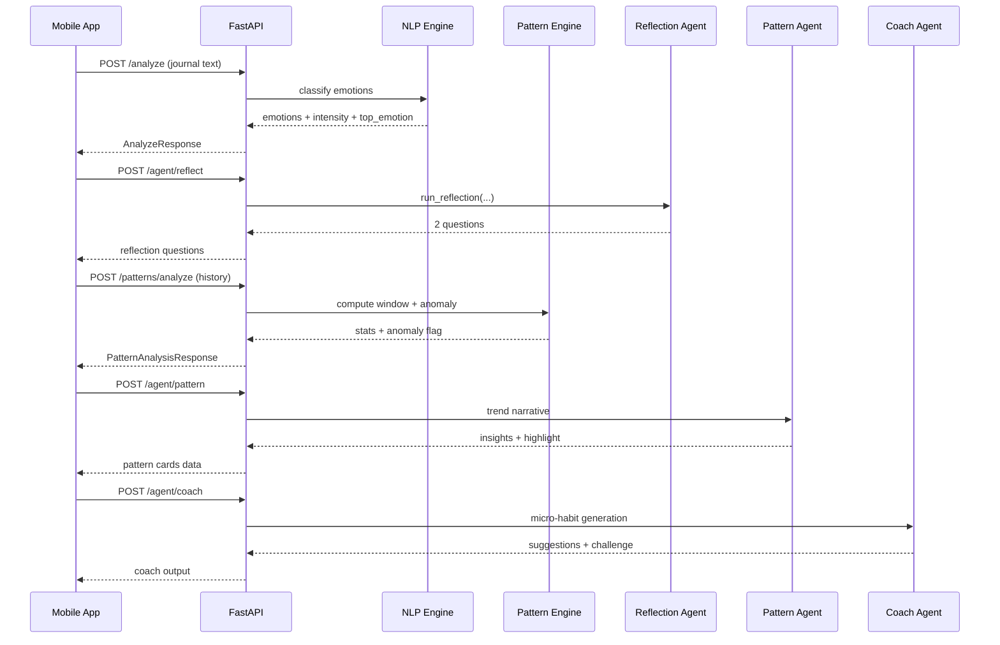

# Silent Spiral

Silent Spiral is a privacy-first, non-clinical emotional self-awareness companion.

It combines:

- FastAPI backend for NLP, pattern analysis, and multi-agent orchestration
- Expo React Native mobile app for journaling, voice capture, check-ins, and insights
- A multi-agent pipeline: Reflection, Pattern, Coach, Burst, and Session

This project is for reflection support, not diagnosis or treatment.

## What Is Implemented

### Backend

- Emotion analysis endpoint using GoEmotions model (`POST /analyze`)
- Pattern window and anomaly detection (`POST /patterns/analyze`)
- Agent routes:
  - Reflection (`POST /agent/reflect`)
  - Pattern narrative (`POST /agent/pattern`)
  - Coach suggestions (`POST /agent/coach`)
  - Burst flow (`POST /agent/burst/ack`, `POST /agent/burst/close`)
  - 10-minute listening session flow (`POST /agent/session/start|message|close`)
- Audio transcription fallback (`POST /transcribe`)
- Auth routes (`POST /auth/register`, `POST /auth/login`)
- Startup warmup for NLP model and DB initialization

### Mobile

- Auth flow with secure local session persistence
- Journaling screen with daily prompt, emotion tags, and reflection questions
- Voice input path with speech recognition and server transcription fallback
- Silent check-in (5-tap mood logging)
- 10-minute private listening modal
- Dashboard with heatmap, timeline, Spiral Score, pattern cards, and coach output
- Local user-scoped storage via AsyncStorage with migration and cleanup guards

## Architecture

```mermaid
flowchart LR
  U[User] --> M[Expo Mobile App]

  subgraph Mobile
    M --> J[Journal + Voice]
    M --> S[Silent Check-in]
    M --> D[Dashboard]
    M --> L[Listening Session Modal]
    M --> LS[(AsyncStorage + SecureStore)]
  end

  M --> API[FastAPI Backend]

  subgraph Backend
    API --> A[/analyze]
    API --> P[/patterns/analyze]
    API --> AG[/agent/*]
    API --> T[/transcribe]
    API --> AU[/auth/*]
  end

  A --> HF[Transformers GoEmotions]
  AG --> GQ[Groq LLM]
  AG --> HFAPI[HuggingFace Inference]
  AU --> MDB[(MongoDB Atlas)]
  AG --> QD[(Qdrant Vector Store)]
```

## Agent Pipeline (Current)



## Repository Structure

```text
SilentSpiral/
  backend/
    app/
      agents/
      core/
      db/
      models/
      routes/
      schemas/
      services/
    tests/
    requirements.txt
  mobile/
    app/
    components/
    context/
    hooks/
    services/
    package.json
  silent_spiral_plan.md
```

## Tech Stack

### Backend

- FastAPI, Uvicorn
- Pydantic v2, pydantic-settings
- Transformers, Torch, Sentence Transformers
- LangChain, LangGraph
- Groq SDK, HuggingFace Hub
- Qdrant client
- MongoDB (Motor), SQLAlchemy, Alembic
- Pytest, pytest-asyncio

### Mobile

- Expo SDK 54
- React Native 0.81, React 19
- Expo Router
- Axios
- expo-av, expo-speech-recognition, expo-secure-store
- TypeScript

## Quick Start

### 1) Backend setup

```powershell
cd backend
python -m venv .venv
.\.venv\Scripts\activate
pip install -r requirements.txt
copy .env.example .env
```

Fill your `.env` values (Groq, HuggingFace, MongoDB, Qdrant as needed).

Run backend:

```powershell
cd backend
.\.venv\Scripts\python.exe -m uvicorn app.main:app --reload --host 0.0.0.0 --port 8000
```

API docs:

- Swagger: http://localhost:8000/docs
- ReDoc: http://localhost:8000/redoc
- Health: http://localhost:8000/health

### 2) Mobile setup

```powershell
cd mobile
npm install
npm run start
```

Optional mobile env override (`mobile/.env.local`):

```bash
EXPO_PUBLIC_API_BASE_URL=http://<your-lan-ip>:8000
```

## Environment Variables

### Backend (`backend/.env`)

Core keys:

- `DEBUG`
- `NLP_MODEL_NAME`
- `NLP_EMOTION_THRESHOLD`
- `NLP_TOP_K`
- `HUGGINGFACE_API_TOKEN`
- `GROQ_API_KEY`
- `GROQ_MODEL`
- `MONGODB_URL`
- `MONGODB_DB_NAME`
- `MONGODB_USERS_COLLECTION`
- `QDRANT_URL`
- `QDRANT_API_KEY`
- `QDRANT_COLLECTION_NAME`
- `NEON_DATABASE_URL` (optional fallback)
- `DATABASE_URL` (legacy fallback)

### Mobile (`mobile/.env` or `.env.local`)

- `EXPO_PUBLIC_API_BASE_URL`

## API Surface

### Health

- `GET /health`

### Auth

- `POST /auth/register`
- `POST /auth/login`

### NLP + Patterns

- `POST /analyze`
- `POST /patterns/analyze`

### Agents

- `POST /agent/reflect`
- `POST /agent/pattern`
- `POST /agent/coach`
- `POST /agent/burst/ack`
- `POST /agent/burst/close`
- `POST /agent/session/start`
- `POST /agent/session/message`
- `POST /agent/session/close`

### Voice

- `POST /transcribe`

## Privacy and Safety Notes

- The app is designed for self-reflection support.
- Burst and listening session flows are implemented as ephemeral interactions.
- Mobile data is user-scoped and cleared on sign-out paths.
- This is not a medical device and does not provide crisis intervention.

## Testing

Run all backend tests:

```powershell
cd backend
.\.venv\Scripts\python.exe -m pytest
```

Skip integration tests for faster local iteration:

```powershell
cd backend
.\.venv\Scripts\python.exe -m pytest -m "not integration"
```

## Troubleshooting

### First `/analyze` can be slow

- The model is warmed at startup, but cold boots can still take time on low-resource machines.

### Phone cannot reach backend

- Use `EXPO_PUBLIC_API_BASE_URL` with your LAN IP.
- Ensure backend runs on `0.0.0.0:8000`.
- Ensure phone and laptop are on the same Wi-Fi network.

### Missing API keys

- Missing `GROQ_API_KEY` and `HUGGINGFACE_API_TOKEN` can cause graceful fallback or route errors depending on endpoint.

## Roadmap Reference

Planning and feature roadmap live in `silent_spiral_plan.md`.

## Safety Disclaimer

Silent Spiral is not a medical product.
If someone is in immediate danger, contact local emergency or crisis services right away.
