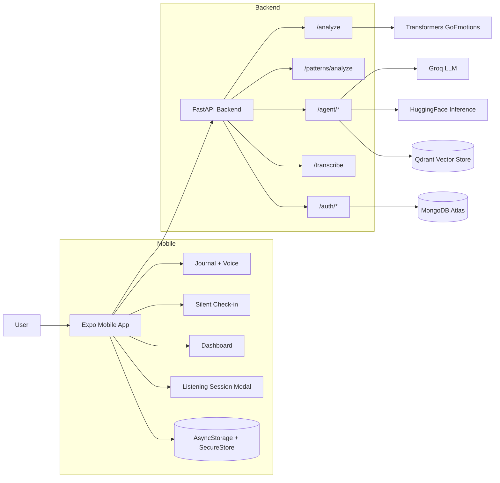
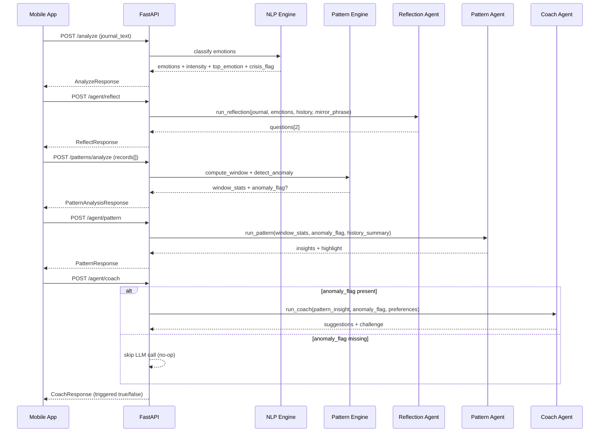
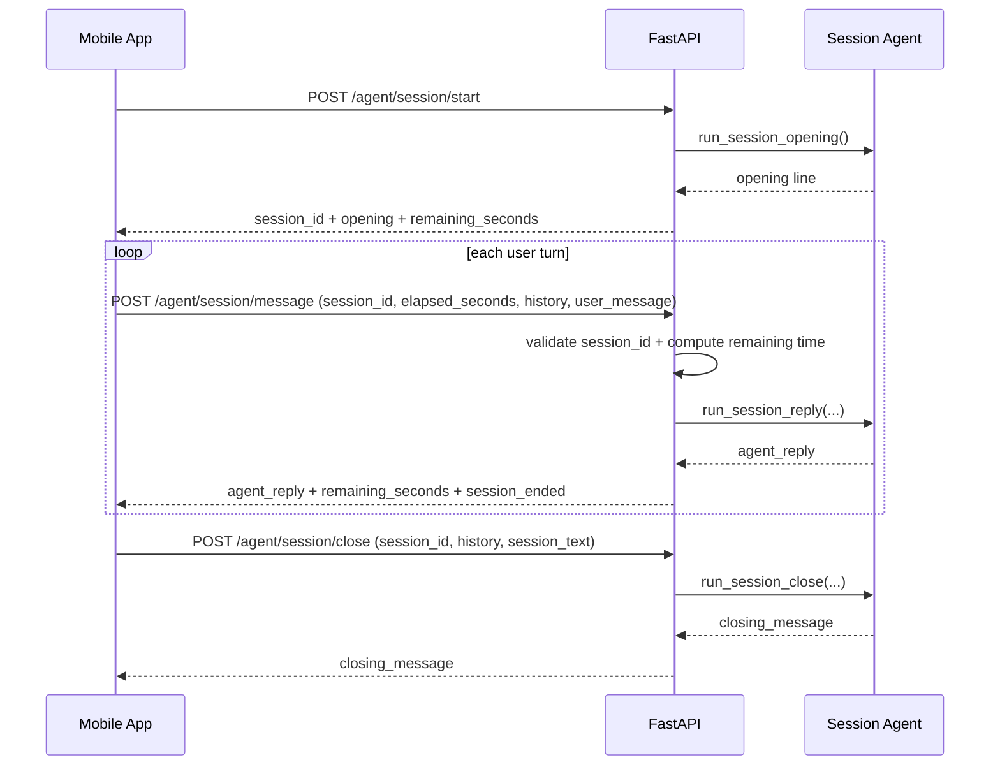

# Reflectra

Reflectra is a privacy-first, non-clinical emotional self-awareness companion.

> Implemented Agentic Architecture: Reflectra already runs a multi-agent orchestration system in production flow, including Reflection, Pattern, Coach, Burst, and Session agents.

It combines:

- FastAPI backend for NLP, pattern analysis, and multi-agent orchestration
- Expo React Native mobile app for journaling, voice capture, check-ins, and insights
- A multi-agent pipeline: Reflection, Pattern, Coach, and Session

This project is for reflection support, not diagnosis or treatment.

## What Is Implemented

### Backend

- Emotion analysis endpoint using GoEmotions model (`POST /analyze`)
- Pattern window and anomaly detection (`POST /patterns/analyze`)
- Agentic architecture implemented end-to-end via orchestrated `/agent/*` routes and specialized agents
- Agent routes:
  - Reflection (`POST /agent/reflect`)
  - Pattern narrative (`POST /agent/pattern`)
  - Coach suggestions (`POST /agent/coach`)
  - Burst flow (`POST /agent/burst/ack`, `POST /agent/burst/close`)
  - 10-minute listening session flow (`POST /agent/session/start|message|close`)
- Audio transcription fallback (`POST /transcribe`)
- Auth routes (`POST /auth/register`, `POST /auth/login`)
- Startup warmup for NLP model and DB initialization

### Mobile

- Auth flow with secure local session persistence
- Journaling screen with daily prompt, emotion tags, and reflection questions
- Voice input path with speech recognition and server transcription fallback
- Silent check-in (5-tap mood logging)
- 10-minute private listening modal
- Dashboard with heatmap, timeline, Spiral Score, pattern cards, and coach output
- Local user-scoped storage via AsyncStorage with migration and cleanup guards

## Architecture



## Agent System Deep Dive (How Everything Works)

This backend separates the AI stack into two layers:

1. Deterministic analysis layer (no LLM creativity):
   - `POST /analyze` runs the GoEmotions NLP classifier on journal text.
   - `POST /patterns/analyze` computes window statistics and anomaly flags from emotion history.
2. Narrative agent layer (LLM-generated language):
   - Reflection Agent (`POST /agent/reflect`)
   - Pattern Agent (`POST /agent/pattern`)
   - Coach Agent (`POST /agent/coach`)
   - Session Agent (`POST /agent/session/start|message|close`)

### Agent-by-Agent Responsibilities

| Agent | Endpoint(s) | What it takes in | What it returns | Guardrails |
|---|---|---|---|---|
| Reflection | `/agent/reflect` | Journal text + detected emotions + optional history + optional mirror phrase | Exactly 2 open-ended reflection questions | Non-clinical language, short questions, fallback questions on parse/API failure |
| Pattern | `/agent/pattern` | `WindowStats` + optional anomaly + optional history summary | 3-5 insight sentences + 1 short card highlight | Observation-only tone (no diagnosis), fallback narrative on parse/API failure |
| Coach | `/agent/coach` | Pattern narrative + anomaly flag + optional user preferences | 0-2 micro-habit suggestions + 1-day challenge | If `anomaly_flag` is `null`, it short-circuits (no LLM call, empty response) |
| Session | `/agent/session/start`, `/agent/session/message`, `/agent/session/close` | Client-provided session timeline + history | Opening line, turn-by-turn listener reply, final closing line | Server stores no conversation; session timing encoded in `session_id` |

### End-to-End Journal Orchestration



### Reflection Agent: How It Decides Questions

- Input context:
  - current journal text
  - top detected emotions from `/analyze`
  - last few reflection items for continuity
  - optional `mirror_phrase` from vector similarity logic
- Runtime behavior:
  - single-node LangGraph invocation (one-shot)
  - strict JSON output parsing (`questions` only)
  - malformed or empty model output falls back to safe default questions
- UX goal:
  - help the user explore feelings with curiosity, not advice

### Pattern Agent: How It Turns Stats into Narrative

- Input context:
  - dominant emotion
  - top average emotion scores
  - volatility score
  - entry count
  - anomaly description (if detected)
- Runtime behavior:
  - converts numeric window stats into plain-language trend narrative
  - returns both rich `insights` and compact `highlight` for cards
  - fallback content ensures UI never receives an empty pattern card
- UX goal:
  - reflect trends and shifts in second-person language, no diagnosis

### Coach Agent: Conditional Micro-Habits

- Trigger rule:
  - only meaningful when an anomaly exists
  - if anomaly is absent, response is intentionally empty and `triggered=false`
- Output style:
  - optional phrasing only ("you might try...")
  - tiny actions (usually under 10 minutes)
  - one concrete challenge for tomorrow
- UX goal:
  - provide gentle next-step ideas only when signal strength is high

### Session Agent: Ephemeral 10-Minute Listener Chat



- Server-side design:
  - session start time is encoded in the `session_id`
  - elapsed and remaining time are computed server-side each turn
  - client sends recent history; backend does not persist chat transcript

### Reliability and Failure Handling

- Route layer maps provider failures to meaningful HTTP errors (401, 429, 503) where appropriate.
- Agent layer has safe local fallbacks if model output is malformed or provider calls fail.
- This means UI still gets useful text even during transient provider issues.

### Safety + Privacy Boundaries

- The system is non-clinical by prompt design and response contracts.
- Burst and Session flows are explicitly ephemeral and do not write user text to storage.
- Primary product data (auth, journal history, trends) remains in the app data stores, while agent calls are request-scoped runtime operations.

## Repository Structure

```text
Reflectra/
  backend/
    app/
      agents/
      core/
      db/
      models/
      routes/
      schemas/
      services/
    tests/
    requirements.txt
  mobile/
    app/
    components/
    context/
    hooks/
    services/
    package.json
  reflectra_plan.md
```

## Tech Stack

### Backend

- FastAPI, Uvicorn
- Pydantic v2, pydantic-settings
- Transformers, Torch, Sentence Transformers
- LangChain, LangGraph
- Groq SDK, HuggingFace Hub
- Qdrant client
- MongoDB (Motor), SQLAlchemy, Alembic
- Pytest, pytest-asyncio

### Mobile

- Expo SDK 54
- React Native 0.81, React 19
- Expo Router
- Axios
- expo-av, expo-speech-recognition, expo-secure-store
- TypeScript

## Quick Start

### 1) Backend setup

```powershell
cd backend
python -m venv .venv
.\.venv\Scripts\activate
pip install -r requirements.txt
copy .env.example .env
```

Fill your `.env` values (Groq, HuggingFace, MongoDB, Qdrant as needed).

Run backend:

```powershell
cd backend
.\.venv\Scripts\python.exe -m uvicorn app.main:app --reload --host 0.0.0.0 --port 8000
```


### 2) Mobile setup

```powershell
cd mobile
npm install
npm run start
```

Optional mobile env override (`mobile/.env.local`):

```bash
EXPO_PUBLIC_API_BASE_URL=http://<your-lan-ip>:8000
```

## Environment Variables

### Backend (`backend/.env`)

Core keys:

- `DEBUG`
- `NLP_MODEL_NAME`
- `NLP_EMOTION_THRESHOLD`
- `NLP_TOP_K`
- `HUGGINGFACE_API_TOKEN`
- `GROQ_API_KEY`
- `GROQ_MODEL`
- `MONGODB_URL`
- `MONGODB_DB_NAME`
- `MONGODB_USERS_COLLECTION`
- `QDRANT_URL`
- `QDRANT_API_KEY`
- `QDRANT_COLLECTION_NAME`
- `NEON_DATABASE_URL` (optional fallback)
- `DATABASE_URL` (legacy fallback)

### Mobile (`mobile/.env` or `.env.local`)

- `EXPO_PUBLIC_API_BASE_URL`

## API Surface

### Health

- `GET /health`

### Auth

- `POST /auth/register`
- `POST /auth/login`

### NLP + Patterns

- `POST /analyze`
- `POST /patterns/analyze`

### Agents

- `POST /agent/reflect`
- `POST /agent/pattern`
- `POST /agent/coach`
- `POST /agent/burst/ack`
- `POST /agent/burst/close`
- `POST /agent/session/start`
- `POST /agent/session/message`
- `POST /agent/session/close`

### Voice

- `POST /transcribe`

## Privacy and Safety Notes

- The app is designed for self-reflection support.
- Burst and listening session flows are implemented as ephemeral interactions.
- Mobile data is user-scoped and cleared on sign-out paths.
- This is not a medical device and does not provide crisis intervention.

## Testing

Run all backend tests:

```powershell
cd backend
.\.venv\Scripts\python.exe -m pytest
```

Skip integration tests for faster local iteration:

```powershell
cd backend
.\.venv\Scripts\python.exe -m pytest -m "not integration"
```

## Troubleshooting

### First `/analyze` can be slow

- The model is warmed at startup, but cold boots can still take time on low-resource machines.

### Phone cannot reach backend

- Use `EXPO_PUBLIC_API_BASE_URL` with your LAN IP.
- Ensure backend runs on `0.0.0.0:8000`.
- Ensure phone and laptop are on the same Wi-Fi network.

### Missing API keys

- Missing `GROQ_API_KEY` and `HUGGINGFACE_API_TOKEN` can cause graceful fallback or route errors depending on endpoint.

## Roadmap Reference

Planning and feature roadmap live in `reflectra_plan.md`.

## Safety Disclaimer

Reflectra is not a medical product.
If someone is in immediate danger, contact local emergency or crisis services right away.
