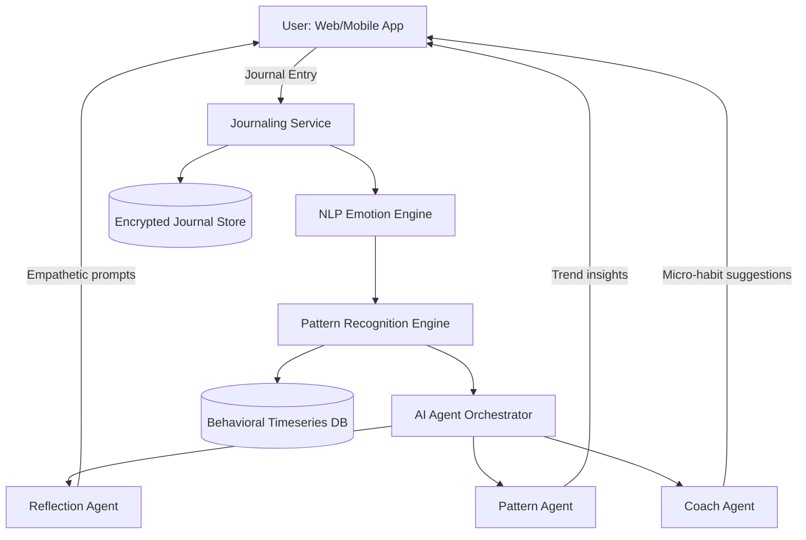

# Plan: The Silent Spiral — Personal Mental-State Awareness Companion

Build a private, non-clinical self-awareness companion that uses NLP-driven journaling, pattern recognition, and AI agents to help users observe emotional and behavioral trends over time.

> **Kaizen Principle Applied:** Each standout feature below is a single, atomic improvement — small enough to build in isolation, impactful enough to compound into a differentiated product.

---

## Scope

**In:**
- Guided journaling UI (text + optional voice-to-text)
- NLP emotion detection on journal entries
- Pattern recognition over time (mood trends, behavioral signals)
- Emotional vocabulary expansion prompts
- AI Agent pipeline (Reflection, Pattern, Coach agents)
- User dashboard: timeline, mood heatmap, trend insights
- Privacy-first local/encrypted data model

**Out:**
- Clinical diagnosis or therapy recommendations
- Crisis intervention or emergency services
- Social sharing or community features
- Wearable / biometric integrations (stretch)

---

## Architecture Overview



---

## System Components

### 1. Journaling Service
- Free-form text editor with optional voice input
- Prompt injection: "What are you feeling right now? What happened today?"
- Entry tagging: energy level, sleep, social interaction (optional self-report)

### 2. NLP Emotion Engine
- **Model**: Fine-tuned transformer (e.g., `roberta-base` on GoEmotions or EmoBank)
- **Output**: Multi-label emotion scores (joy, sadness, anxiety, anger, calm, etc.)
- **Also extracts**: Sentiment polarity, emotional intensity, key themes
- **Stack**: Python FastAPI microservice → HuggingFace Inference or local ONNX

### 3. Pattern Recognition Engine
- Sliding-window analysis over emotion scores (7d, 30d)
- Detects: mood dips, volatility spikes, positive streaks
- Flags behavioral signals from self-reports: irregular sleep, social withdrawal
- **Stack**: Python (pandas + scikit-learn) with time-series anomaly detection

### 4. AI Agent Orchestrator (Core Innovation)

Three autonomous agents, each with specific roles:

| Agent | Role | Trigger |
|---|---|---|
| **Reflection Agent** | Generates empathetic follow-up prompts post-entry | After every journal entry |
| **Pattern Agent** | Synthesizes trends into natural-language insights | Weekly / on-demand |
| **Coach Agent** | Suggests micro-habits & reflection exercises | When pattern threshold crossed |

**Agent Stack**: LangGraph (stateful agent graphs) + LLM (GPT-4o or local Mistral)

---

## AI Agent Design (Detailed)

### Reflection Agent
```
Input:  Raw journal text + detected emotions
Memory: Last 5 entries (sliding context window)
Output: 2-3 follow-up reflection questions
Prompt: "You are a gentle, non-clinical companion. Ask open-ended questions
         that help the user explore their feelings deeper. Never diagnose."
```

### Pattern Agent
```
Input:  Timeseries of emotion vectors (30-day window)
Memory: Long-term summary (vector DB, e.g., Chroma)
Output: 3-5 sentence insight about observed emotional trends
Example: "Over the past 2 weeks, your entries reflect increased
          anxiety around Sunday evenings and calmer states mid-week."
```

### Coach Agent
```
Input:  Pattern Agent output + user profile (preferences, past habits)
Trigger: Pattern crosses threshold (e.g., 5-day downward spiral detected)
Output: 1-2 gentle micro-habit suggestions (journaling prompts, breathing, walks)
Constraint: Never prescriptive — always "you might try..." framing
```

### Agent Memory Architecture
- **Short-term**: Last N journal entries in context window
- **Long-term**: Summarized emotional history in vector DB (Chroma/pgvector)
- **State**: LangGraph persistent checkpointing (Redis or SQLite)

---

## Tech Stack

| Layer | Technology |
|---|---|
| Frontend | React + Next.js (App Router) |
| Styling | Tailwind CSS + Framer Motion |
| Backend API | FastAPI (Python) |
| NLP Service | HuggingFace Transformers (emotion model) |
| Agent Framework | LangGraph + LangChain |
| LLM | OpenAI GPT-4o-mini / local Mistral |
| Vector DB | Chroma (local) or Pinecone |
| Journal Store | PostgreSQL (encrypted at rest) |
| Timeseries | InfluxDB or Postgres with time partitions |
| Auth | Clerk or Supabase Auth |
| Deployment | Vercel (frontend) + Railway/Fly.io (backend) |

---

## 🌟 Standout Features (Kaizen-Driven Differentiators)

These features are chosen for **maximum differentiation with minimal scope** — each solves one real user problem, is error-proof by design, and builds on the existing core without over-engineering.

---

### 1. 🌀 Spiral Score — Single Emotional Health Indicator

> *"Users don't want 10 numbers. They want one honest signal."*

- A single 0–100 score computed from emotion vectors, entry frequency, and volatility
- Color and shape morphs from calm (smooth green spiral) to distressed (jagged red spiral)
- **Why it stands out:** Most apps show raw charts. This gives users a single, scannable signal they actually understand at a glance
- **Poka-Yoke:** Score never labelled as a health metric — always framed as a *"reflection consistency score"* to prevent clinical misinterpretation

---

### 2. 🧬 Emotional DNA — Personalized Emotion Fingerprint

> *"Nobody feels the same emotions in the same way."*

- After 14 days, generate a user's **emotional fingerprint**: their top 5 recurring emotions, typical intensity range, and trigger signatures
- Displayed as a unique visual pattern (radar chart or generative art) — shareable but only locally
- **Why it stands out:** Makes the product feel deeply personal, not generic. Users see *themselves* in the data
- **Kaizen:** Built incrementally — starts as a static chart, evolves into a generative visual as data grows

---

### 3. 🔇 Silent Mode — Passive Behavioral Check-ins

> *"Sometimes users don't want to write. They still want to be seen."*

- On low-energy days, instead of forcing journaling, offer a **5-tap check-in**: one emoji per dimension (energy, mood, sleep, social, focus)
- Counts as a session — keeps streak alive, still feeds the pattern engine
- **Why it stands out:** Solves the #1 drop-off reason: journaling fatigue. Lowers friction to near-zero
- **JIT:** Build this in Week 2 — only after journaling UI is live and friction data is observed

---

### 4. 🪞 Mirror Prompt — AI Reflects Your Own Words Back

> *"The most powerful question is one the user almost asked themselves."*

- Instead of generic prompts, the Reflection Agent pulls **exact phrases from past entries** and reflects them:
  > *"Last Tuesday you wrote 'I feel invisible at work.' Does that still feel true?"*
- Uses semantic similarity (vector DB) to surface emotionally resonant past moments
- **Why it stands out:** No other journaling app does this. It feels uncanny in the best way — like the app truly *remembers*
- **Poka-Yoke:** Only surfaces entries ≥ 7 days old and only when semantic similarity > 0.85, preventing false or jarring matches

---

### 5. 📅 Temporal Pattern Cards — "Your Sunday Nights"

> *"Patterns are only useful when they're specific."*

- Instead of a generic mood graph, surface **named temporal patterns**:
  - *"Your Sunday nights have been heavy for 3 weeks"*
  - *"You write 40% more on rainy days"*
  - *"Your calmest entries happen before 8am"*
- Generated by Pattern Agent, displayed as shareable insight cards
- **Why it stands out:** Feels like a discovery, not a dashboard. Emotionally resonant and highly shareable (word-of-mouth growth vector)

---

### 6. 🌱 Micro-Commit Habits — 1-Day Challenges

> *"Don't suggest a 30-day habit. Suggest one thing for tomorrow."*

- Coach Agent issues a **single micro-challenge** tied to the user's pattern:
  > *"Tomorrow: write one sentence before you check your phone."*
- User marks it done with a tap the next day — creates a tiny feedback loop
- **Why it stands out:** Bridges reflection → action without being prescriptive. Kaizen in product form: one small step, verified before the next
- **JIT:** Ships only after Coach Agent is stable — not premature

---

### 7. 🔐 Local-First Privacy Architecture

> *"The most underrated feature in mental health tech is trust."*

- All journal text processed **on-device** via ONNX-quantized emotion model
- Only *emotion vectors* (numbers, not text) sent to backend — raw text never leaves the device
- **Why it stands out:** Most competitors send raw journal text to cloud APIs. This is a genuine architectural differentiator and a strong trust signal
- **Poka-Yoke by design:** System is architecturally incapable of leaking raw journal content — not just a policy, a constraint

---

## Kaizen Improvement Roadmap

| Phase | Feature | Principle Applied |
|---|---|---|
| Week 1 | Core journaling + NLP + Reflection Agent | Make it work |
| Week 2 | Spiral Score + Silent Mode | Make it clear |
| Week 3 | Mirror Prompt + Temporal Pattern Cards | Make it compelling |
| Week 4 | Emotional DNA + Micro-Commit Habits | Make it sticky |
| Stretch | Local-First ONNX privacy mode | Make it trustworthy |

---

## Action Items

- [ ] **Design** data models: `JournalEntry`, `EmotionVector`, `PatternWindow`, `UserProfile`
- [ ] **Build** Journaling UI: editor, prompt injection, entry history timeline
- [ ] **Integrate** NLP Emotion Engine: fine-tune/deploy GoEmotions classifier via FastAPI
- [ ] **Build** Pattern Recognition Engine: sliding-window trend detector + anomaly flagging
- [ ] **Implement** Reflection Agent: LangGraph node with empathetic prompt generation
- [ ] **Implement** Pattern Agent: weekly synthesis from timeseries + vector memory
- [ ] **Implement** Coach Agent: threshold-triggered micro-habit suggestions
- [ ] **Build** Dashboard: mood heatmap, emotion timeline, trend cards
- [ ] **Add** Emotional Vocabulary Expander: suggest richer words alongside raw entry
- [ ] **Validate** end-to-end: write test journal entries → verify emotion detection → agent responses → trend dashboard

---

## Open Questions

1. **Privacy model**: Should all NLP processing happen on-device (local model) or via API? On-device is more private but lower accuracy.
2. **Onboarding**: Should the app include a brief emotional vocabulary tutorial to reduce cold-start effect?
3. **Escalation boundary**: What trigger logic determines when to show a gentle "consider speaking to someone" message vs. remaining silent?

---

## 👥 Team Work Division (4 Members)

> 2 experienced devs (🔥) — 2 less experienced / non-dev members (🌱)

---

### 🔥 Dev 1 — Backend + AI Agents *(Experienced)*

**Owns:** The intelligence layer

| Task | Details |
|---|---|
| NLP Emotion Engine | Set up FastAPI + HuggingFace GoEmotions model, ONNX export for local inference |
| Pattern Recognition Engine | Sliding-window trend detector, anomaly detection logic |
| Reflection Agent | LangGraph node — empathetic follow-up prompt generation |
| Pattern Agent | Weekly synthesis from timeseries + vector DB memory |
| Coach Agent | Threshold-triggered micro-habit suggestions |
| Mirror Prompt logic | Semantic similarity search over past entries via vector DB |

---

### 🔥 Dev 2 — Frontend + Dashboard *(Experienced)*

**Owns:** Everything the user sees

| Task | Details |
|---|---|
| Journaling UI | Rich text editor, daily prompt injection, entry history |
| Dashboard | Mood heatmap, emotion timeline, Spiral Score visualization |
| Silent Mode | 5-tap emoji check-in screen |
| Temporal Pattern Cards | Insight card UI, animations (Framer Motion) |
| Auth + routing | Clerk/Supabase auth, Next.js App Router setup |
| API integration | Connect frontend to FastAPI backend endpoints |

---

### 🌱 Member 3 — Content + UX Research *(Less Dev Experience)*

**Owns:** The words and flows users experience

| Task | Details |
|---|---|
| Journaling prompts library | Write 30+ daily reflection prompts, vary by mood/theme |
| Emotional vocabulary guide | Build word list: basic → nuanced emotions (for onboarding) |
| Micro-challenge content | Write 20+ Coach Agent micro-habit suggestions |
| Onboarding copy | Write the 3-screen onboarding flow content |
| App UX wireframes | Lo-fi wireframes in Figma or even paper — screens and flows |
| User testing | Test flows, give feedback on tone, flag anything that feels clinical |

---

### 🌱 Member 4 — Demo + Presentation *(Less Dev Experience)*

**Owns:** Making the project shine to judges

| Task | Details |
|---|---|
| Demo script | Write the 2-minute demo walkthrough: user journey story |
| Slide deck | Architecture overview, problem statement, feature highlights |
| Sample journal entries | Create realistic fake journal entries for demo data |
| README | Write the project README: setup, features, team |
| Pitch narrative | Craft the "why this matters" story for judges |
| Video demo recording | Record a walkthrough video of the live product |

---

## 📆 Sprint Summary

| Week | Dev 1 | Dev 2 | Member 3 | Member 4 |
|---|---|---|---|---|
| 1 | NLP Engine + FastAPI | Journaling UI + Auth | Write prompts library | Problem statement + slides |
| 2 | Reflection + Pattern Agent | Dashboard + Spiral Score | Emotional vocab guide + onboarding copy | Sample journal data + README |
| 3 | Coach Agent + Mirror Prompt | Silent Mode + Pattern Cards | Micro-challenges content + UX feedback | Demo script + walkthrough video |
| 4 | Polish + ONNX local inference | Performance + bug fix | Final UX review + tone check | Final pitch + submission prep |